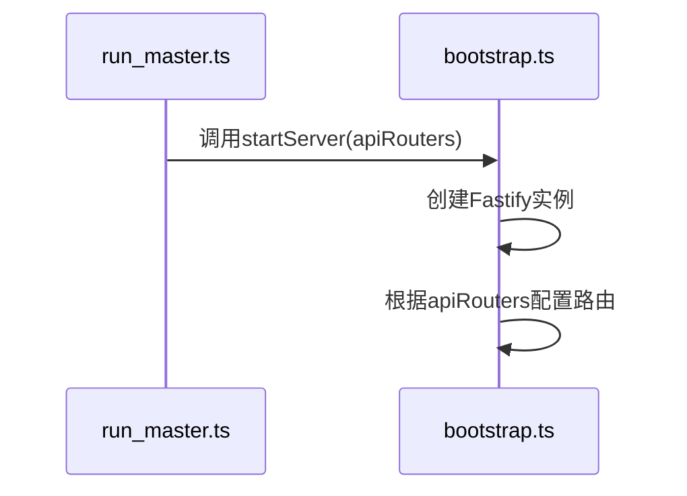

### 主信令服务流程
  ```
  根据运行服务的指令：npm run start:master
  我们知道最终执行的是 src/run_master.ts文件
  run_master.ts文件内容如下：
  ```
  ```typescript
    import 'node-fetch';
    import apiRouters from './apis/master.js';
    import { startServer } from './utils/index.js';
    startServer(apiRouters);
  ```


#### 信令服务提供的HTTP接口
| HTTP Method | Endpoint                   | Description             | Example Request Body                                                |
|-------------|----------------------------|-------------------------|---------------------------------------------------------------------|
| GET         | `/api/rooms`               | 获取当前房间列表         | `{"page":1,"pageSize":2,"orderBy":"-createDate"}`                     |
| POST        | `/api/rooms`               | 创建房间                 | `{ "id": "房间ID", "rtpCapabilities": {rtp能力json} }`               |
| GET         | `/api/rooms/:roomId`        | 获取指定房间能力         | roomId:房间ID, body: `{ "id": "房间ID", "rtpCapabilities": {rtp能力json} }` |
| DELETE      | `/api/rooms/:roomId`        | 删除房间                 | roomId:房间id                                                        |
| POST        | `/api/rooms/:roomId/consumer_routers` | 创建消费者路由   | roomId:房间id                                                        |
| POST        | `/api/rooms/:roomId/producer_transports` | 创建生产者传输 | `{"roomId":"房间ID","userId":"用户ID","metadata":"自定义数据"}`         |
| GET         | `/api/rooms/:roomId/producer_transports` | 获取生产者传输 | roomId:房间id                                                        |
| POST        | `/api/rooms/:roomId/consumer_transports` | 创建消费者传输 | `{"roomId":"房间ID","userId":"用户ID","metadata":"自定义数据"}`         |
| POST        | `/api/router/:routerId/consumer_transports` | 创建消费者传输 | `{"routerId":"路由ID","userId":"用户ID"}`                             |
| POST        | `/apt/producer_transports/:transportId/connect` | 连接生产者传输 | `{"transportId":"传输ID","dtlsParameters":{dtls参数json}}`           |
| POST        | `/api/consumer_transports/:transportId/connect` | 连接消费者传输 | `{"transportId":"传输ID","dtlsParameters":{dtls参数json}}`           |
| POST        | `/api/producers/:producerId/resume` | 恢复生产者传输     | producerId:生产者id                                                  |
| POST        | `/api/producers/:producerId/pause` | 暂停生产者传输     | producerId:生产者id                                                  |
| POST        | `/api/consumer_transports/:transportId/consume` | 创建消费传输 | `{"transportId":"传输ID","producerId":"生产者ID","rtpCapabilities":{rtp能力json}}` |
| POST        | `/api/user/:userId/logout`  | 用户登出                 | `{"userId":"用户ID","roomId":"房间ID"}`                               |
| DELETE      | `/api/transports/:transportId` | 删除传输               | transportId:传输id                                                   |
#### 具体流程图：
