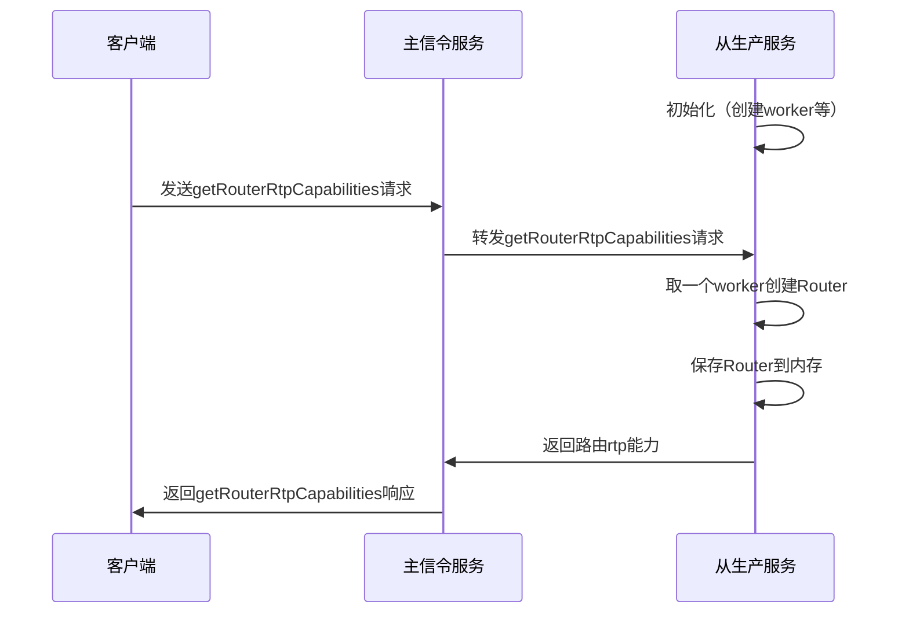

```mermaid
sequenceDiagram
    participant Client as 客户端
    participant Master as 主信令服务
    participant Producer as 从生产服务
    Producer->>Producer: 初始化（创建worker等）
    Client->>Master: 发送getRouterRtpCapabilities请求
    Master->>Producer: 转发getRouterRtpCapabilities请求
    Producer->>Producer: 取一个worker创建Router
    Producer->>Producer: 保存Router到内存
    Producer->>Master: 返回路由rtp能力
    Master->>Client: 返回getRouterRtpCapabilities响应
```

#### 说明

  1. 所有从服务初始化时候都会创建worker，worker是工作进程，是mediasoup的资源
  2. 信令服务只转发信令请求，不处理业务逻辑，所以信令服务不会创建room，也不会保存room到数据库
