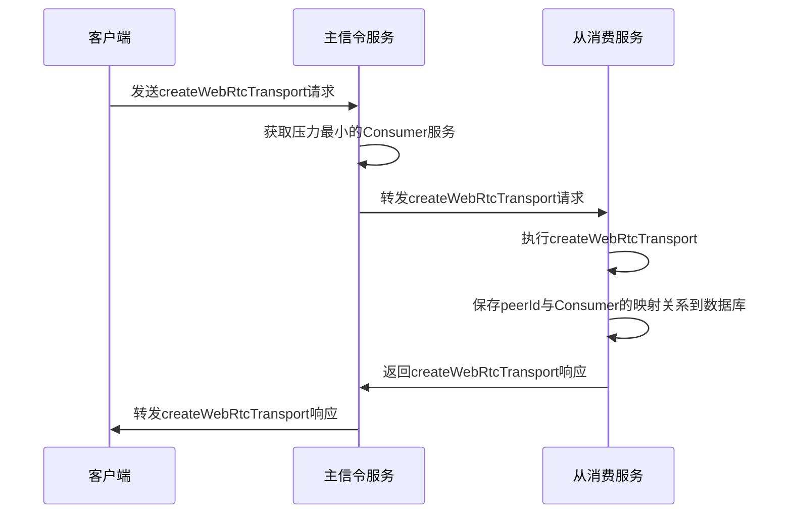

#### 说明

    1. createWebRtcTransport请求创建的是一个无peer连接的WebRtcTransport类型传输
    2. 在执行创建WebRtcTransport时，需要记录此WebRtcTransport在数据表，需要通过id找到创建此WebRtcTransport的consumer的IP和端口
    3. 注意，这里和原集群的/rooms/:roomId/consumer_transports流程类似，原集群是在主信令服务调用http接口
    到从生产服务，在从生产服务调用mediasoup的原生接口createWebRtcTransport
    4. 注意，这里返回的结果带有iceCandidates，在什么服务调用createWebRtcTransport则返回的iceCandidates
    里面就会带上该服务器IP
