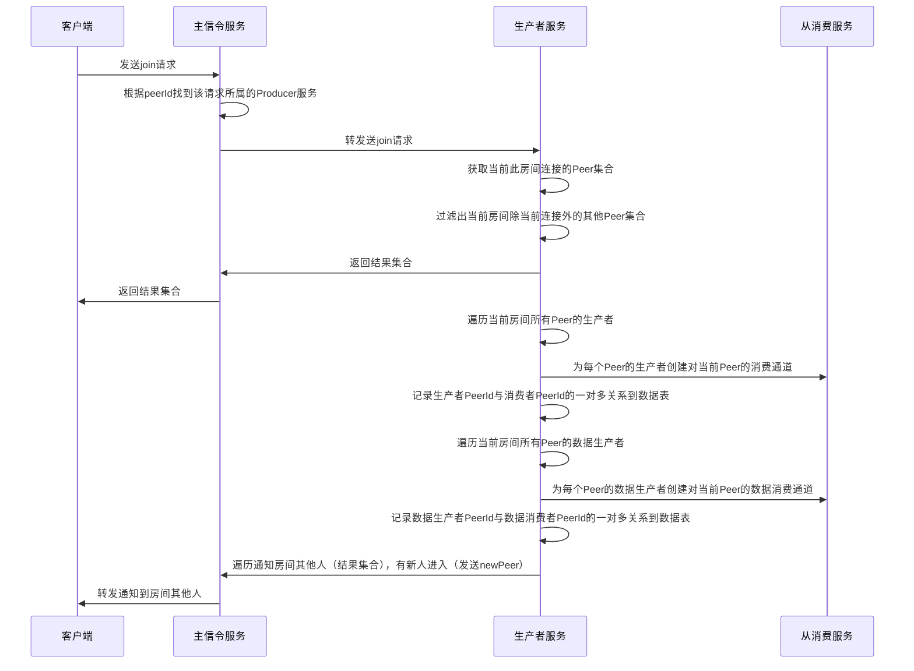

#### 说明

    1. 客户端发送join请求，Master服务转发给生产者服务
    2. 客户端连接信令服务的时候，会创建Peer集合，此集合在数据表有一份
    3. 生产服务从数据表中获取Peer集合
    4. 在生产服务如何判断当前连接？信令服务转发请求的时候带上PeerId

##### 为每个Peer生产者创建消费通道具体流程
此流程实际就是集群Demo的/consumer_transports/:transportId/consume接口
```mermaid
sequenceDiagram
    participant Producer as 生产者服务
    participant Consumer as 从消费服务
    Producer->>Producer: 使用transportId从media_transport和media_worker中联表查询transport信息
    Producer->>Producer: 从media_router表获取router信息，从media_worker表获取worker信息，从media_room表获取room信息
    Producer->>Consumer: /router/:routerId/destination_pipe_transport创建目的地pipetransport通道
    note over Producer,Consumer: /router/:routerId/destination_pipe_transport逻辑
    Consumer->>Consumer: 根据routerId获取router对象
    Consumer->>Consumer: router.createPipeTransport创建pipetransport通道并保存到map
    Consumer->>Producer: /router/:routerId/source_pipe_transport创建来源pipetransport通道
    note over Producer,Consumer: /router/:routerId/source_pipe_transport逻辑
    Producer->>Producer: 根据routerId获取router对象
    Producer->>Producer: router.createPipeTransport创建pipetransport通道并保存到map
    Producer->>Producer: transport.connect(生产服务IP端口)
    note over Producer,Consumer: /router/:routerId/source_pipe_transport逻辑
    Consumer->>Consumer: transport.connect(消费服务IP端口)
    Consumer->>Producer: /pipe_transport/:transportId/consume
    note over Producer,Consumer: /pipe_transport/:transportId/consume逻辑
    Producer->>Producer: 使用transportId获取transport对象，并transport.consume打开消费通道
    note over Producer,Consumer: /pipe_transport/:transportId/consume逻辑
    Consumer->>Consumer: transport.produce打开生产通道
    note over Producer,Consumer: /router/:routerId/destination_pipe_transport逻辑
    Producer->>Consumer: /transports/:transportId/consumer
    note over Producer,Consumer: /transports/:transportId/consumer逻辑
    Consumer->>Consumer: 根据routerId获取router对象，确保此路由具有消费能力
    Consumer->>Consumer: transport.consume(生产者producerId)，准备消费音视频
    note over Producer,Consumer: /transports/:transportId/consumer逻辑
    Producer->>Producer: 保存结果到media_consumer表
````

#### 说明
    以上是每一次创建消费者的步骤