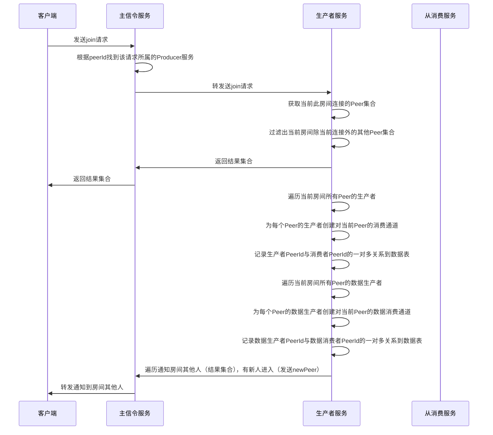

```mermaid
sequenceDiagram
    participant Client as 客户端
    participant Master as 主信令服务
    participant Producer as 生产者服务
    participant Consumer as 从消费服务
    
    Client->>Master: 发送join请求
    Master->>Master: 根据peerId找到该请求所属的Producer服务
    Master->>Producer: 转发送join请求
    Producer->>Producer: 获取当前此房间连接的Peer集合
    Producer->>Producer: 过滤出当前房间除当前连接外的其他Peer集合
    Producer->>Master: 返回结果集合
    Master->>Client: 返回结果集合
    Producer->>Producer: 遍历当前房间所有Peer的生产者
    Producer->>Producer: 为每个Peer的生产者创建对当前Peer的消费通道
    Producer->>Producer: 记录生产者PeerId与消费者PeerId的一对多关系到数据表
    Producer->>Producer: 遍历当前房间所有Peer的数据生产者
    Producer->>Producer: 为每个Peer的数据生产者创建对当前Peer的数据消费通道
    Producer->>Producer: 记录数据生产者PeerId与数据消费者PeerId的一对多关系到数据表
    Producer->>Master: 遍历通知房间其他人（结果集合），有新人进入（发送newPeer）
    Master->>Client: 转发通知到房间其他人
```

#### 说明

    1. 客户端发送join请求，Master服务转发给生产者服务
    2. 客户端连接信令服务的时候，会创建Peer集合，此集合在数据表有一份
    3. 生产服务从数据表中获取Peer集合
    4. 在生产服务如何判断当前连接？信令服务转发请求的时候带上PeerId
