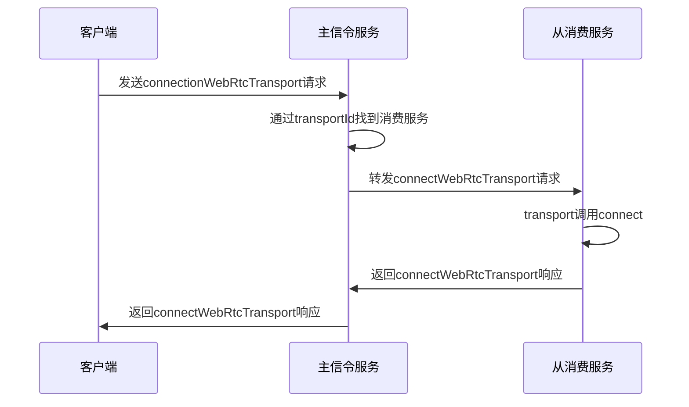

```mermaid
sequenceDiagram
    participant Client as 客户端
    participant Master as 主信令服务
    participant Consumer as 从消费服务
    Client->>Master: 发送connectionWebRtcTransport请求
    Master->>Master: 通过transportId找到消费服务
    Master->>Consumer: 转发connectWebRtcTransport请求
    Consumer->>Consumer: transport调用connect
    Consumer->>Master: 返回connectWebRtcTransport响应
    Master->>Client: 返回connectWebRtcTransport响应
```
