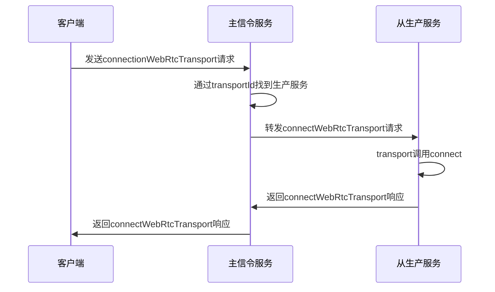

```mermaid
sequenceDiagram
    participant Client as 客户端
    participant Master as 主信令服务
    participant Producer as 从生产服务
    Client->>Master: 发送connectionWebRtcTransport请求
    Master->>Master: 通过transportId找到生产服务
    Master->>Producer: 转发connectWebRtcTransport请求
    Producer->>Producer: transport调用connect
    Producer->>Master: 返回connectWebRtcTransport响应
    Master->>Client: 返回connectWebRtcTransport响应
```
