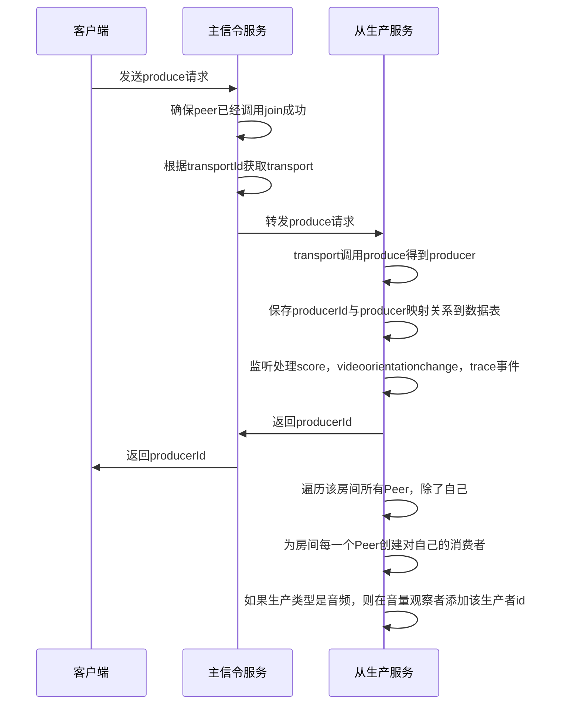

```mermaid
sequenceDiagram
    participant Client as 客户端
    participant Master as 主信令服务
    participant Producer as 从生产服务
    Client->>Master: 发送produce请求
    Master->>Master: 确保peer已经调用join成功
    Master->>Master: 根据transportId获取transport
    Master->>Producer: 转发produce请求
    Producer->>Producer: transport调用produce得到producer
    Producer->>Producer: 保存producerId与producer映射关系到数据表
    Producer->>Producer: 监听处理score，videoorientationchange，trace事件
    Producer->>Master: 返回producerId
    Master->>Client: 返回producerId
    Producer->>Producer: 遍历该房间所有Peer，除了自己
    Producer->>Producer: 为房间每一个Peer创建对自己的消费者
    Producer->>Producer: 如果生产类型是音频，则在音量观察者添加该生产者id
```

#### 说明

    1. 为房间每一个Peer创建对自己的消费者，效果是相当于在服务端创建了消费者，服务端会
    消费该Peer的媒体流，然后转发给其他Peer
