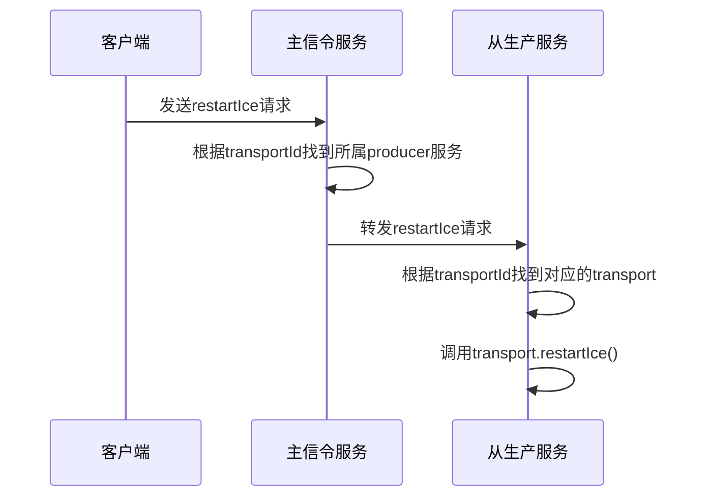

```mermaid
sequenceDiagram
    participant Client as 客户端
    participant Master as 主信令服务
    participant Producer as 从生产服务
    Client->>Master: 发送restartIce请求
    Master->>Master: 根据transportId找到所属producer服务
    Master->>Producer: 转发restartIce请求
    Producer->>Producer: 根据transportId找到对应的transport
    Producer->>Producer: 调用transport.restartIce()
```
