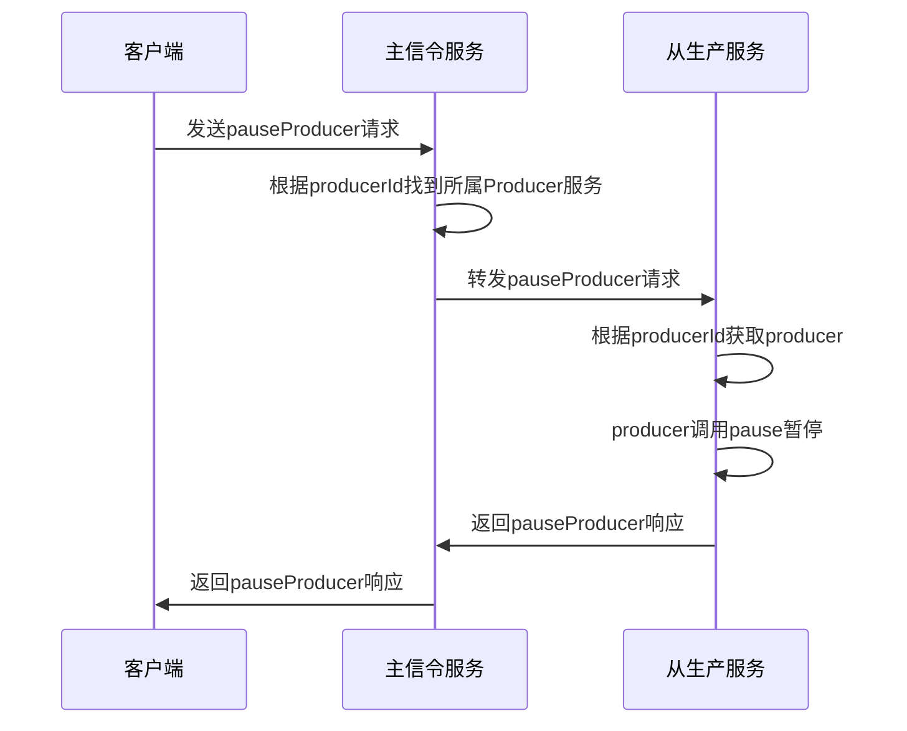

```mermaid
sequenceDiagram
    participant Client as 客户端
    participant Master as 主信令服务
    participant Producer as 从生产服务
    Client->>Master: 发送pauseProducer请求
    Master->>Master: 根据producerId找到所属Producer服务
    Master->>Producer: 转发pauseProducer请求
    Producer->>Producer: 根据producerId获取producer
    Producer->>Producer: producer调用pause暂停
    Producer->>Master: 返回pauseProducer响应
    Master->>Client: 返回pauseProducer响应
```
