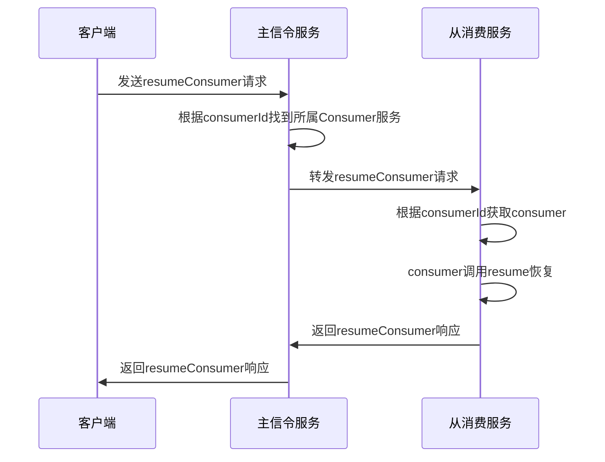

```mermaid
sequenceDiagram
    participant Client as 客户端
    participant Master as 主信令服务
    participant Consumer as 从消费服务
    Client->>Master: 发送resumeConsumer请求
    Master->>Master: 根据consumerId找到所属Consumer服务
    Master->>Consumer: 转发resumeConsumer请求
    Consumer->>Consumer: 根据consumerId获取consumer
    Consumer->>Consumer: consumer调用resume恢复
    Consumer->>Master: 返回resumeConsumer响应
    Master->>Client: 返回resumeConsumer响应
```
