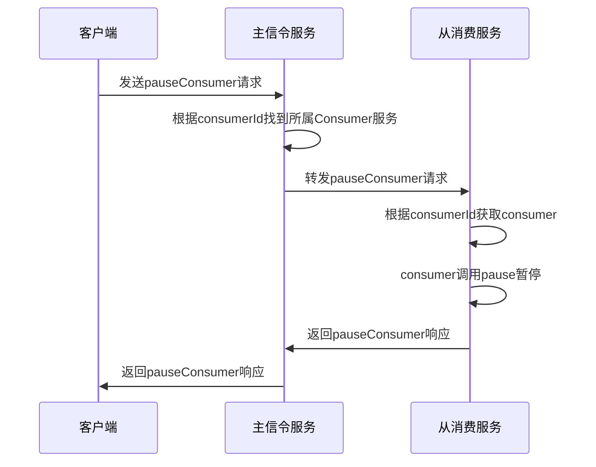

```mermaid
sequenceDiagram
    participant Client as 客户端
    participant Master as 主信令服务
    participant Consumer as 从消费服务
    Client->>Master: 发送pauseConsumer请求
    Master->>Master: 根据consumerId找到所属Consumer服务
    Master->>Consumer: 转发pauseConsumer请求
    Consumer->>Consumer: 根据consumerId获取consumer
    Consumer->>Consumer: consumer调用pause暂停
    Consumer->>Master: 返回pauseConsumer响应
    Master->>Client: 返回pauseConsumer响应
```
