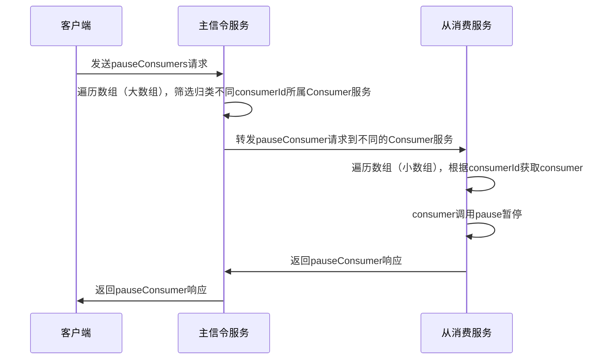

```mermaid
sequenceDiagram
    participant Client as 客户端
    participant Master as 主信令服务
    participant Consumer as 从消费服务
    Client->>Master: 发送pauseConsumers请求
    Master->>Master: 遍历数组（大数组），筛选归类不同consumerId所属Consumer服务
    Master->>Consumer: 转发pauseConsumer请求到不同的Consumer服务
    Consumer->>Consumer: 遍历数组（小数组），根据consumerId获取consumer
    Consumer->>Consumer: consumer调用pause暂停
    Consumer->>Master: 返回pauseConsumer响应
    Master->>Client: 返回pauseConsumer响应
```

#### 说明

    1. pauseConsumers请求是数组，而数组里面的consumerId可能属于不同的Consumer服务
    2. 主服务需要先筛选过来一次，把大数组分成小数组，然后发给不同的Consumer服务
