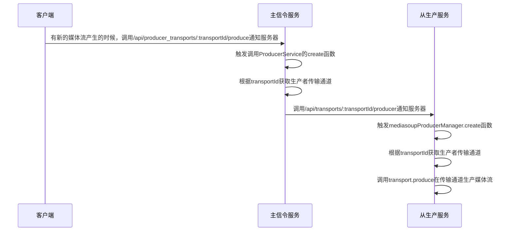

### 客户端生产音视频流程
 
 点击页面的Produce按钮，具体流程
 ```mermaid
 sequenceDiagram
    participant Client as 客户端
    participant Master as 主信令服务
    participant Producer as 从生产服务
    participant Consumer as 从消费服务
    Client->>Client: 点击Produce按钮，触发Producer对象的produce函数
    Client->>Master: 调用/api/rooms/:roomId/producer_transports接口获取生产者
    Master->>Master: 在media_transport表中查询该房间的生产者
    Master->>Master: room调用initSendTransport初始化生产者传输通道
    Note over Client, Master: 媒体传输通道事件
    Client->>Master: 在通道连接成功的时候，调用/api/producer_transports/:transportId/connect发送连接确认
    Client->>Master: 有新的媒体流产生的时候，调用/api/producer_transports/:transportId/produce通知服务器
    Note over Client, Master: 媒体传输通道事件
    Client->>Client: 调用webrtc接口navigator.mediaDevices.getUserMedia获取媒体流(音频或视频)
    Client->>Client: 获取到音视频，分别调用mediasoup的接口transport.produce绑定轨道
    Client->>Client: 触发不同的传输通道事件
 ```

 ### 传输通道事件具体流程
 #### connect事件
 ```mermaid
 sequenceDiagram
   participant Client as 客户端
   participant Master as 主信令服务
   participant Producer as 从生产服务
   Client->>Master: 调用/api/producer_transports/:transportId/connect发送连接确认
   Master->>Master: 触发调用connectProducer函数
   Master->>Master: 根据transportId获取生产者传输通道
   Master->>Producer: 调用/api/producer_transports/:transportId/connect发送连接确认
   Producer->>Producer: 触发connect函数
   Producer->>Producer: 调用transport.connect连接dtls参数
```


#### produce事件

