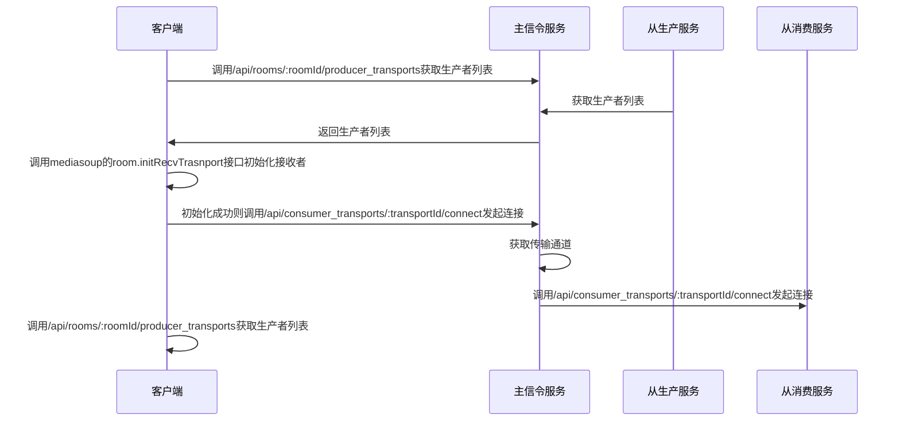

### 客户端获取生产者流程
点击页面Get Producers按钮，具体流程

```mermaid
sequenceDiagram
    participant Client as 客户端
    participant Master as 主信令服务
    participant Producer as 从生产服务
    participant Consumer as 从消费服务
    Client->>Master: 调用/api/rooms/:roomId/producer_transports获取生产者列表
    Producer->>Master: 获取生产者列表
    Master->>Client: 返回生产者列表
    Client->>Client: 调用mediasoup的room.initRecvTrasnport接口初始化接收者
    Client->>Master: 初始化成功则调用/api/consumer_transports/:transportId/connect发起连接
    Master->>Master: 获取传输通道
    Master->>Consumer: 调用/api/consumer_transports/:transportId/connect发起连接
    Client->>Client: 调用/api/rooms/:roomId/producer_transports获取生产者列表
```