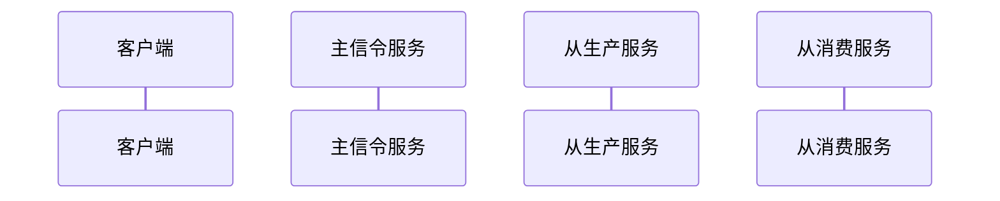

#### 加入会议流程

加入会议涉及的信令如下：
  1、getRouterRtpCapabilities
  2、join
  3、createWebRtcTransport
  4、connectWebRtcTransport
  6、produce/closeProducer
  7、pauseProducer/resumeProducer
  8、pauseConsumer/resumeConsumer
  9、pauseConsumers/resumeConsumers

