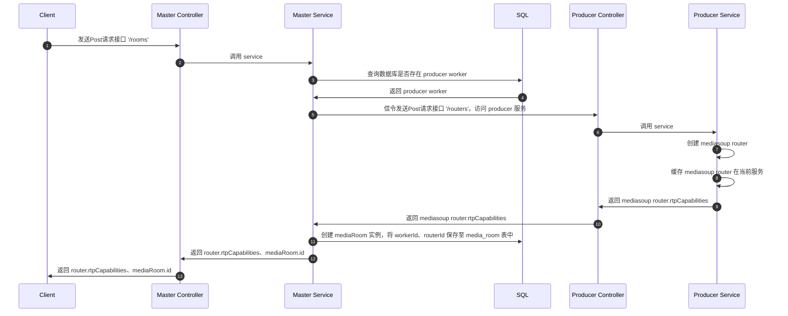
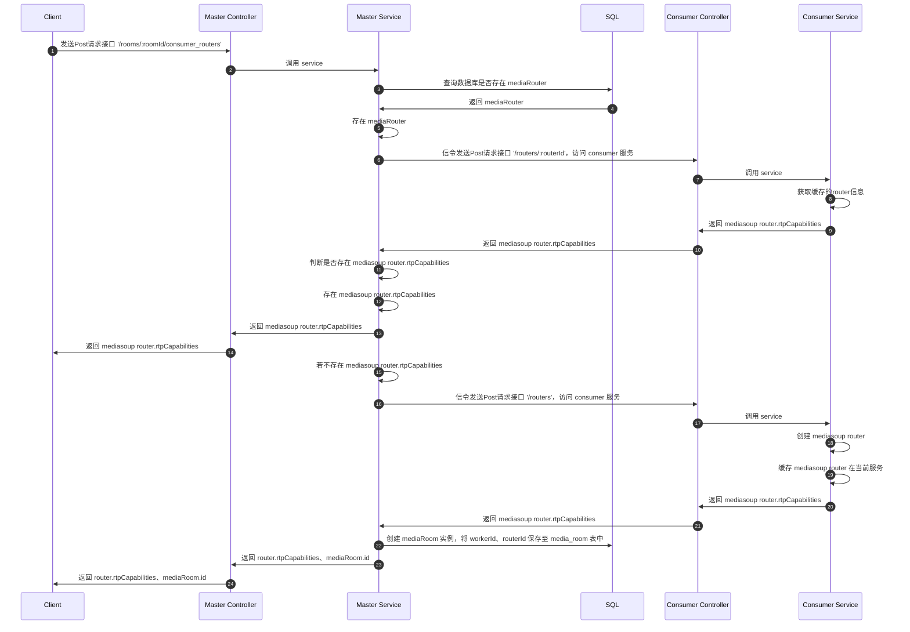
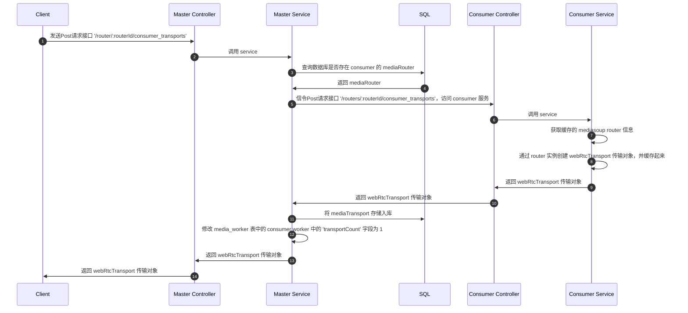

## Http 部分

| 是否迁移 |接口 | 方法 |描述|
|-- |-- |-- |--|
| ✅ |/rooms/:roomId |GET | 获取房间的 rtp 能力 |
|  | /rooms/:roomId/broadcasters | POST | 创建一个广播者 |
|  | /rooms/:roomId/broadcasters/:broadcasterId | DELETE | 删除广播者 |
|  | /rooms/:roomId/broadcasters/:broadcasterId/transports | POST | 创建与广播器关联的媒体组传输，可以用于 PlainTransport 或 WebrtcTransport 类型传输 |
|  | /rooms/:roomId/broadcasters/:broadcasterId/transports/:transportId/connect | POST | 连接属于广播器的传输 |
|  | /rooms/:roomId/broadcasters/:broadcasterId/transports/:transportId/producers | POST | 创建与广播器关联的生产者 |
|  | /rooms/:roomId/broadcasters/:broadcasterId/transports/:transportId/consume | POST | 创建与广播器关联的消费者 |
|  | /rooms/:roomId/broadcasters/:broadcasterId/transports/:transportId/consume/data | POST | 创建与广播器关联的数据生产者 |
|  | /rooms/:roomId/broadcasters/:broadcasterId/transports/:transportId/produce/data | POST | 创建与广播器关联的数据消费者 |
|  | 自己添加的 HTTP 接口 | -- | -- |
|  | /rooms/:roomId/broadcasters/:broadcasterId/consume/:consumeId/resume | POST | 恢复消费 |
|  | /rooms/:roomId/broadcasters/:broadcasterId/transports/:transportId/plainconnect | POST | 连接属于广播器的传输：特指 PlainTransport |


## 流程图

### 创建房间

#### 创建 room



小结：
- 此流程在 producer 服务中，只创建了一个 router，返回给 master 再返回给客户端（客户端并没有使用，也就是说这里创建的 router 毫无用处）
- master 也没有真正意思上的创建 room（只是 new 了 MediaRoom 创建了一个实例，并在表中插入了一条数据，就当作是创建房间了）
- 客户端只接收了 room id

#### 创建 router



小结：
- 此流程 consumer 服务中，只创建了一个 router，返回给 master 再返回给客户端（客户端真正应用了routerId、rtpCapabilities）
- 客户端接收了 routerId、rtpCapabilities

问题：
为什么创建房间，要设计成2个接口？客户端的逻辑是怎么样的？
1、第一个接口（/rooms）是创建 room
2、第二个接口（/rooms/:roomId/consumer_routers）是创建 mediasoup router

<br/>

上述流程总结：
- 创建 Room 的逻辑是在 master 中；创建 router 的逻辑从 consumer 服务中创建！
- 创建 worker 需要 'meidasoup' 包，2个从服务都创建了 worker，创建 worker 的目的是为了创建 router。

结合 record 总结：
- 由于集群并没有ws的逻辑，因此 master 也不存在创建 worker 的逻辑。但是record有ws的逻辑，因此需要存在创建worker的逻辑。所以在master中也加入创建 worker 的逻辑没有问题。

<br/>
<br/>

### 主页初始化

#### 主页初始化时，创建了 webRtcTransport 传输对象



小结：此流程先获取了 consumer 的 router，使用 router 创建 webRtcTransport 传输对象，返回给客户端，并存入到数据库。

<br/>
<br/>
<br/>

问题：
接口 `/router/:routerId/consumer_transports`，返回的 webrtc transport 内容，有什么作用？
```json
{
  "id": "0d98404a-eb61-4c2c-ab88-cbd52891ef4e",
  "iceParameters": { },
  "iceCandidates": [ ],
  "dtlsParameters": { }
}
```
